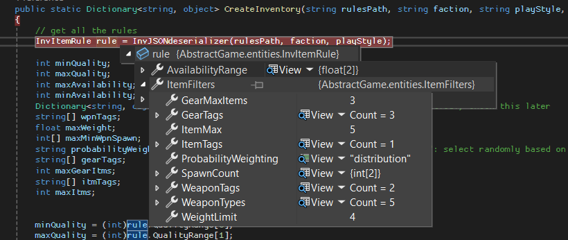

## Grob-Planung
Aktuell geht es mir sehr gut in der Schule. Ich habe einen 5er-Schnitt, der sich wahrscheinlich noch verbessern wird, und ein paar Fächer, in denen ich im letzten Semester nicht mein volles Potenzial ausgeschöpft habe.
Dieses Jahr war ich in allen Modulen etwa gleich stark. In Informatik habe ich leider auch einen 5er-Schnitt, weil ich ein paar Fehler gemacht habe.
Für dieses Modul wäre es sinnvoll, ein Projekt zu machen, bei dem man viel mit der Struktur von verschiedenen Objekten und der Speicherung von Daten arbeitet. Ursprünglich wollte ich unseren SmartPainter mit der WinForms Graphics Box nachbauen, aber ich habe mich diese Woche dagegen entschieden, da Alex es schon mit C++ umsetzt – und ich brauche eigentlich keine noch schnellere Version.

## 14.02.2025: Explorativer Wegwerf-Prototyp
- [x] Winforms Graphics box
- [x] 60 FPS

Heute habe ich mithifle von viel ChatGPT ein Picturebox in Winforms gemacht welche individuell Pixel updaten kann (farbe, X, Y). Der Code wurde komplett con KI gereinigt aber manchmal gibt es immer noch ein "object already in use" exception, es passiert aber nicht oft genug um es sinnvoll zu debuggen. 


## 21.2: Explorativer Wegwerf-Prototyp
- [x] Class/Data structure festlegen
- [x] Minimale Variablen festlegen
- [x] Main Menu
- [x] CreateGame (nur difficulty, name)

Heute habe ich auf Papier eine Programmarchitektur für ein Videospiel entwickelt, aber es ist alles noch abstrakt – also gibt es zum Beispiel keinen echten Game.Render oder ähnliches. Es geht nur um die Struktur. Ich habe festgelegt, welche Variablen wo sind, wie sie hin und her fließen und wie ich sie am besten speichern bzw. bearbeiten könnte.
Dann habe ich ein sehr simples Proof-of-Concept-Wegwerfprogramm gemacht, das nur zwei Optionen zum Erstellen eines Spiels hatte und nur drei Dinge als gameData gespeichert hat. Die Struktur hat aber Sinn gemacht, und ich habe die Architektur leicht erweitert für den Prototyp mit der Kernfunktionalität.
Da ich oft vergesse zu committen, habe ich mir Google Tasks auf mein Handy heruntergeladen und eine wiederkehrende Aufgabe eingestellt, die mich daran erinnert.

## 28.2: Kern-Funktionalität
- [x] Dateien für die vollständige Programmarchitektur hinzufügen
- [x] JSON Datei für die Factions und Playstyles inklusive class dafür
- [x] Display choices(and description) und CreateGame ausbauen mit Faction, playstyle und gamename
- [ ] SaveGame mit JSON savefile (JSON writer) (nicht gemacht weil umwechsel auf SQLite, welche Architekturänderung fordert)
Optional:


Heute habe ich die Wegwerfversion so umgebaut, dass sie jetzt komplett mit dem Modell übereinstimmt (nicht mit weniger Features wie das ursprüngliche Wegwerfmodell) und statt .txt eine JSON-Datei verwendet, in der die Beschreibungen stehen.
Ich hatte Probleme mit dem Deserialisieren dieser Datei, konnte das aber schlussendlich beheben und die Daten erfolgreich auslesen und darstellen.
Die CreateGame-Methode hat jetzt auch zusätzliche Parameter, die ich nur auswählen konnte, indem ich die Factions und Playstyles anzeige und dann eine Auswahloption anbiete.
Mit diesen neuen Features wird es immer wichtiger, mehr Exception Handling und Inputverarbeitung zu integrieren, da es oft Eingaben gibt, die case-sensitive sind (z. B. Factions), oder Eingaben, die nur int akzeptieren und keine Verarbeitung für Strings haben.
Da es aber aktuell wichtiger ist, zuerst die vollständige Kernfunktionalität zu implementieren, werde ich diese Dinge erst beim „Polieren“ angehen.


## 7.3: Kern-Funktionalität
- [x] DBManager class mit InitalizeDB, DBInsert methoden.
- [x] SQLite gameSave Database erstellen
- [x] SQLite gameSave zum Debuggen lesen (debug class und methode)
- [ ] (Kleiner) ItemList (warscheinlich in JSON) mit starter items, items class und Function welche starter items bestimmt (Item.cs, CreateInventory)

Heute habe ich SQLite in mein Programm implementiert. Ich begann damit, im „systems“-Ordner eine neue Datei und Klasse namens DBManager zu erstellen. Darin habe ich eine InitDB- und eine DBInsert-Methode geschrieben.
InitDB erstellt und initialisiert eine neue Datenbank für das Spiel. Ich bin mir noch nicht ganz sicher (deshalb werde ich nächstes Mal wieder ein Modell entwerfen und etwas darüber nachdenken), ob ich statische Inhalte wie Items in eine separate statische Datenbank auslagere und dann zusätzlich spielspezifische Datenbanken erstelle – oder ob ich einfach eine statische und eine dynamische Datenbank verwende und alles mithilfe einer GameID in die dynamische eintrage.
Die DBInsert-Methode fügt Daten in die Datenbank ein. Sie nimmt als Parameter den Tabellennamen sowie ein Dictionary mit Keys und Values. Ich bin noch unschlüssig, ob ich das für größere Inserts anpassen sollte.

Danach habe ich auch einen debug-Ordner erstellt, in dem sich die Klasse Debug befindet. Dort gibt es die Methode SelectAll sowie das TestJSON, das vorher im FactionLoader war. Ich habe mich für diesen Aufbau entschieden, da es bei der Datenbank oft sehr merkwürdige Probleme gab und ich zukünftig noch mehr JSON-Dateien hinzufügen werde, die deutlich größer sein werden und somit einfacher beschädigt werden können.

Zusätzlich habe ich meine APs für heute etwas angepasst. Der Grund dafür ist, dass SQLite viele Probleme verursacht hat und sehr viel Zeit beansprucht hat. Außerdem haben die ursprünglichen APs keinen Sinn mehr gemacht, da ich eigentlich zuerst andere Systeme brauche. Die APs waren eher „Architektur ausbauen“ als „Kernfunktionalität“.


## 14.3: Architektur ausbauen
- [x] InitDB splitten in InitDB, CreateDB, und richtige DB verwenden (nach GameName)
- [x] Hinzufügen in InitDB: Erstellung Tabellen "World", "NPC"
- [x] Datenmodell für DB (UML und future proof)
- [x] (Kleiner) ItemList (warscheinlich in JSON) mit starter items, items class und Function welche starter items bestimmt (Item.cs, CreateInventory)
- [ ] CreateInventoryMethode

Heute habe ich zunächst InitDB repariert, sodass jetzt beim CreateGame tatsächlich eine neue Datenbank erstellt wird – und nicht einfach nur neue Tabellen. Zuvor führte das zu Konflikten, da zum Beispiel die Tabelle „Player“ bereits existierte.
Außerdem habe ich ein Datenmodell entworfen, da ich ohne ein solches ziemlich schnell den Überblick verliere. Zusätzlich habe ich eine grundlegende ItemList erstellt mit allen Items, die für die CreateInventory-Methode benötigt werden. Es sind viele, weil ich eine gewisse Variation brauche – unterschiedliche Items für verschiedene Playstyles (z. B. bekommt ein Bandit-Raider eher schlechte Ausrüstung, während ein Elite-Commander das Beste vom Besten erhält).

Heute habe ich auch die grundlegende Struktur der Datenbank festgelegt. Die Tabellen sollen möglichst spezialisiert aufgebaut sein, damit ich die Items korrekt zuordnen kann. (Die Items brauchen allerdings noch Parameter – die muss ich noch definieren.)
Die CreateInventory-Methode habe ich noch nicht umgesetzt, da ich mit dem Erstellen der passenden DB-Struktur nicht fertig geworden bin. Ich habe den aktuellen Stand nicht committet, weil er momentan komplett kaputt ist. Das Ausdenken der Struktur hat viel Zeit in Anspruch genommen.


Ich habe noch ein Bild von das neue DB system und auch eines des Datenmodell eingefügt damit ich sie später hier anschauen kann.


NOTE: Sachen wie "ammo types werden nicht sofort in der DB gespeichert sobald sie in-game gewechselt werden (ZB: Shotgun allowed ammo types: buckshot, slug, dragons breath, in game wird shotgun von buckshot zu slug gewechselt) aber sie werden im in-memory gamestate verwaltet und nur gespeichert OnGameSave.
AUCH NOTE: ich möchte gerne (bitte) 3 AP's machen statt 4, aber dafür wird ich sie viel besser ausformulieren, und sie werden die ganze ILA Stunden dauern.


## 21.3: Architektur ausbauen
- [x] Statische DB mit Itemlist
- [x] Tables Hinzufügen in DB, InitDB Methode ausbreiten um mehrere Tabellen zu erstellen
- [ ] CreateInventoryMethode
- [ ] Generation von Locations in World.cs

Heute habe ich das Datenmodell komplett überarbeitet, da die vorherige Version wenig Sinn ergeben hat. Das neue Modell ist nun durchdacht, klar strukturiert, normalisiert und „future-proof“. Wahrscheinlich werden noch kleinere Änderungen dazukommen, aber keine grundlegenden mehr.

Ich habe mich dafür entschieden, dass alle Items, die in der Spielwelt existieren, in ihre jeweiligen Item-Tabellen eingetragen werden. Es gibt mehrere dieser Tabellen, damit die Attribute der Items innerhalb einer Kategorie möglichst ähnlich sind – so lassen sich viele NULL-Felder vermeiden. In diesen Tabellen sind nur die Parameter enthalten, die sich im Spiel tatsächlich verändern können.

Außerdem habe ich im Debug.cs-File im switch-Case eine neue Option namens SQLCreateDB hinzugefügt, mit der ich die statische Datenbank erstellen kann. Bevor ich das implementiert habe, habe ich die Datenbank manuell in SQL Server angelegt und eine einfache Itemliste eingefügt, um erste Tests durchzuführen – vor allem im Hinblick auf JOIN-Abfragen, die später vom C#-Programm verwendet werden sollen.

Zudem habe ich mir ein grundlegendes Schadenssystem überlegt, da ich schon einige Attribute dafür in die Datenbank einpflegen wollte. Zum Testen habe ich vorerst ein einfaches Attribut namens simpleDMG eingeführt.


Es muss schon darauf geachtet werden dass MS SQl und SQLite nicht genau gleich sind und deswegen das Datenmodell nicht 100% passen wird, und das Test DB welches im MS SQL erstellt wurde also auch keine exakte kopie ist. Sobald es komplett richtig funktioniert im SQL Server wird ich es umschreiben für SQLite (double > real etc)

## 26.3:

Heute schreibe ich einen kurzen Beitrag: Ich hatte viele Probleme mit der SQLite-Implementierung. Obwohl anfangs alles reibungslos funktionierte, habe ich ziemlich schnell einiges kaputtgemacht. Es hat eine Weile gedauert, bis ich die Fehler beheben konnte, da ich mir bewusst kein ChatGPT erlaubt habe – ich möchte wirklich verstehen, wie jedes einzelne Detail bei SQLite funktioniert.

Inzwischen läuft wieder alles einwandfrei. Dennoch kann ich ehrlich gesagt nicht behaupten, dass ich mit dem Block „Architektur“ bereits fertig bin. Deshalb werde ich heute und morgen noch ein paar zusätzliche Architektur-Blöcke einbauen, in denen ich die Basisfunktionen überall vervollständige – unter anderem die CreateInventory-Methode und die Location-Generierung. Auch wenn dabei vorerst nur ein paar Test-Items und -Locations verwendet werden, soll alles grundsätzlich funktionieren.

## 28.3: Auspolieren
- [ ] Inputverarbeitung bei "Console.ReadLine();" mit exception handling und die möglichkeit, nochmals ein Input zu geben
- [x] [dbName].db erstellen funktioniert immer, geht aber manchmal nicht im resources Folder (obwohl es so angegeben wird von SQLite??) sondern im bin > debug > net8.0
- [x] Console.Clear(); damit nicht die alte Outputs/inputs immer sichtbar sind

Heute habe ich:
- InvConfig.json erstellt (noch nicht in CreateInventory angewendet)
- Classes für das neue JSON (für deserializing)
- In Faction.cs ein modulärer JSON Deserializer gemacht um der "Proprietäre" von GameOptions.json zu ersetzen, es verwendet als return type ein dynamisches (generic <T>) um mehrere json files zu ünterstützen, es funktioniert aber noch nicht ganz...
- Die DB inserts fertig fur CreateInventory
- Das komische DB in falsche Speicherort-Problem habe ich gelöst, indem ich die SetDatabasePath methode verbessert habe

NOTE: Ich bin in Debug.cs und faction.cs dran, die JSONDeserializers funktionierend zu kriegen und muss die richtige class und type struktur herausfinden


## 4.4: Auspolieren & Abschluss
- [ ] relative paths für resources
- [x] CreateInventoryMethode verbunden mit invConfig.json

# Reflexion 04.04.2024

In dieser Lernperiode wollte ich mich darauf fokussieren, meinen Gedankengang beim Programmieren zu verbessern. Was ich damit meine: Die Übertragung von Logik aus meinem Gehirn zum Computer, also das Programmieren, klappt schon ziemlich gut, obwohl es manchmal lange dauert, eine Lösung für ein Problem zu finden. Ich habe jedoch am meisten Mühe mit der Programmarchitektur und Entscheidungen zu treffen, wie etwas funktionieren wird. Aus diesem Grund habe ich mich dafür entschieden, ein Game-Backend zu entwickeln, da ich hier viele Entscheidungen treffen muss, wie Daten fließen, gespeichert werden, wie die Datenbank strukturiert werden muss und dann zu entscheiden, welche der 300 möglichen Lösungen ich wählen sollte. Meine Vorgehensweise war ein bisschen unkonventionell, da ich von Grund auf gearbeitet habe und immer sehr weit vorausgedacht habe. Normalerweise hätte ich mit so etwas zuerst eine kleine Testdatenbank erstellt, dann ein Tool, um Daten abzurufen und zu schreiben. Diesmal ging ich jedoch so vor:
- Ich mache ein "Game"
- Was braucht ein "Game"
- Zuerst: loading screen (Create Game, Load Game, Settings)
- Um ein Game zu haben, muss man den erstellen können (CreateNewGame Methode)
- Was braucht ein sehr simples Game alles? (Gammename(für LoadGame), Player Name, Difficulty, und Faction und Playstyle da das zu mein Game-style passt)
- Wie speichere ich das alles? -> SQLite & JSON für descriptions and configs)
- Erstelle Test-DB mit "Player" Tabelle mit die oben genannten Parameter
- Teste alles
- Erstelle grosses DB

Jetzt ist die Zeit vorbei, aber die DB funktioniert, was mein Ziel war. Ich habe gelernt, wie ich nachdenken kann und wie ich Lösungen für Probleme finde. Außerdem habe ich, auch wenn ich das nicht hier im Repo habe, geübt, wie man Optionen auswertet für die verschiedenen Lösungen (z. B. Was nutze ich für die Config-Dateien? JSON, INI?).

Daneben muss ich mein OOP-Verständnis verbessern, da ich Klassen meistens nur als Container für Methodengruppen verwendet habe. Jetzt muss ich sie als Objekte verwenden, weil ich nur so das JSON deserialisieren kann.


# Lernperiode 9.2 (Fortsetzung Lernperiode 9.1

Als Lernperiode "5" mache ich eine Fortzsetzung von lernperiode "4", da das Thema dieser Lernperiode "Persistence" ist, und für uns SQL zum üben, und ich schon die ganze letzte Lernperiode mit SQL und JSON gearbeitet habe.
Heute habe ich nochmals mein JSON zur inventoryconfig verändert, um das neue Graph system für die Itemauswahl zu benutzen. Das Graphsystem funktioniert indem jedes Item eine Qualität (X) und verfügbarkeit (Y). Ich habe meine JSON Struktur so gestaltet, dass es pro Playstyle alles gut passt mit die Items.
Dann habe ich die Classes erstellt, um das JSON verwenden zu können. 
Hier ein beispiel vom JSON:
```
{
  "InvItemRules": {
    "Factionless": {
      "Light": {
        "QualityRange": [ 3, 6 ],
        "AvailabilityRange": [ 6, 9 ],
        "ItemFilters": {
          "WeaponTypes": {
            "Pistol": 0.4,
            "SemiAuto": 0.3,
            "ShortRifle": 0.2,
            "Melee": 0.1,
            "Smoke": 0.2
          },
          "WeaponTags": [ "Light", "Reliable" ],
          "WeightLimit": 4.0,
          "SpawnCount": [ 1, 1 ],
          "ProbabilityWeighting": "distribution",

          "GearTags": [ "Navigation", "SurvivalBasic", "Minimal" ],
          "GearMaxItems": 3,

          "ItemTags": [ "Essential" ],
          "ItemMax": 5
        }
      },
```
Wie man sieht ist es jetzt viel mehr optimiert, da zum Beispiel die "Light" Playstyle jetzt wirklich nur die wichtigste Items hat und so wenig wiegt wie möglich.
Dann habe ich die Classes dazu erstellt im `ItemManager.cs`: `ItemFilters` `InvItemRule` `InvItemRuleRoot`.
Und endlich die `CreateInventory` Methode.

## Arbeitspakete 09.05.2025
- [x] attribut "quality" 2 dimensional machen
- [x] attribut "tag" zu Tabellen (mindestens Test-Tabelle) in SQL
- [x] Testtabelle für CreateInevntory

## Zusammenfassung 09.05.2025
Heute habe ich die CreateInventory Methode umgeschrieben, da es nciht gut funktioniert hatte, und ich zur JSON verwendung ChatGPT genutzt hatte wodurch ich nicht gelernt habe wie man Werte in ein sehr veschachteltes JSON rauszieht. Dann habe ich die Testtabelle erstellt und das Skript dazu für SQLite optimiert. (ZB FLOAT zu REAL). Ich habe die neue INSERTS gemacht, damit die Testtabelle das Attribut Tag und das neue Availability hat. Auch habe ich die Tags verändert, damit sie mehr Sinn machen (sie werden sobald der ganze DB implementiert ist warscheinlich nochmals verändert). 

## Arbeitspakete 16.05.2025
- [ ] Fix: beim erstellen einer Datenbank wir immer automatisch die Tabelle Player erstellt, das ist gut aber nicht wenn wir vie Debug.cs die statische DB erstellen möchten.
- [ ] MS SQL zu SQLite kompatibel machen (alle Tabelle-erstellungs Skripte)
- [ ] Die ganze statische DB machen, aber nicht alle inserts (nur player und stat_wpn_gun zum testen)

## Zusammenfassung 16.05.2025


## 4.4: Auspolieren & Abschluss
- [ ] SQL script für DB Item abfragen (select from Tabellen stat_itm_x)
- [ ] NPC factions/playstyles %
- [ ] NPC spawn (random) mit inventories

# Fertiges Projekt
To be continued
